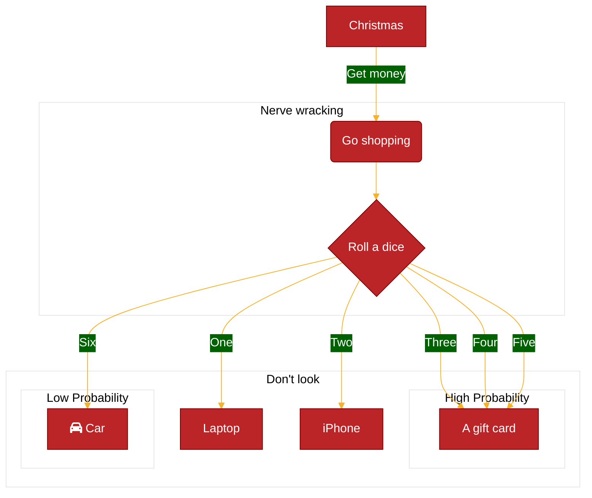

# Tree

```mermaid
%%{
  init: {
    'theme': 'base',
    'themeVariables': {
      'primaryColor': '#BB2528',
      'primaryTextColor': '#fff',
      'primaryBorderColor': '#7C0000',
      'lineColor': '#F8B229',
      'secondaryColor': '#006100',
      'tertiaryColor': '#fff'
    }
  }
}%%
graph TD
A[Christmas] -->|Get money| B(Go shopping)
subgraph Nerve wracking
B --> C{Roll a dice}
end
subgraph Don't look
  C -->|One| D[Laptop]
  C -->|Two| E[iPhone]
  subgraph High Probability
    C-->|Three| G
    C-->|Four| G
    C-->|Five| G[A gift card]
  end
  subgraph Low Probability
    C -->|Six| F[fa:fa-car Car]
  end
end
```
